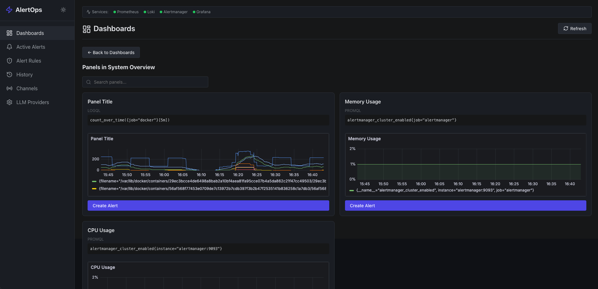
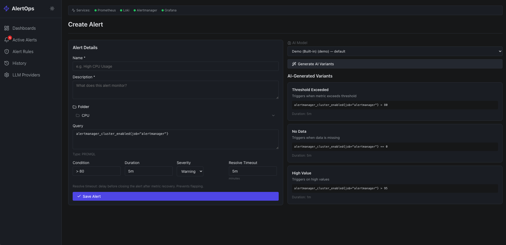
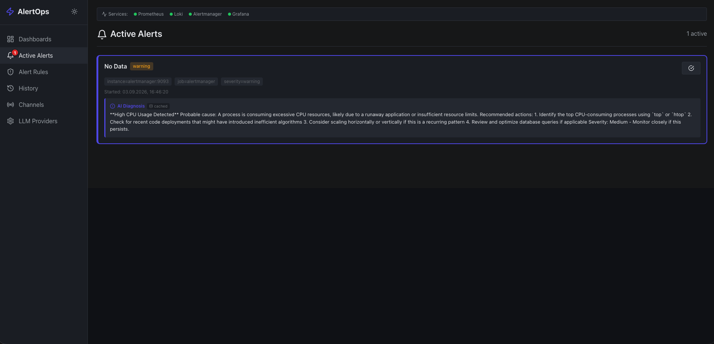
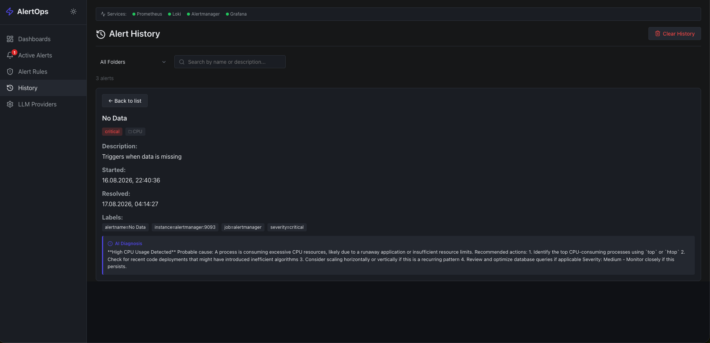
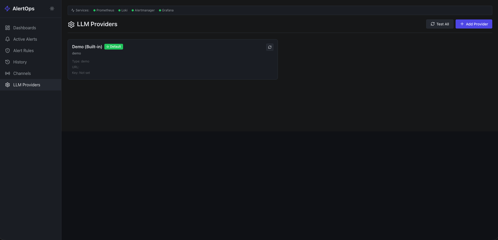

# AlertOps

**AlertOps** is a self-hosted monitoring and alerting platform featuring AI-driven incident diagnostics. It can be deployed with a single command and integrates Prometheus, Loki, Alertmanager, and Grafana into a single, user-friendly interface.

## Overview

AlertOps bridges the gap between raw monitoring data and actionable insights. Instead of manually correlating metrics, logs, and alerts across multiple tools, you get a unified dashboard where you can:

- **Browse Grafana dashboards** and create alert rules directly from any panel
- **Generate alert rules with AI** — the system suggests 3 complete variations (name, description, query, condition, duration) based on the panel's query
- **Receive instant alerts** via Alertmanager webhooks
- **Get AI-powered diagnosis** — automatically fetches relevant logs from Loki and analyzes them with an LLM

## Screenshots

### Dashboard Browser
Browse all Grafana dashboards and panels. Click any panel to create an alert.




---

### Alert Creation Wizard
Generate AI-powered alert rules from panel queries. Each variant includes name, description, query, condition, and duration — all auto-filled on selection. Edit and validate before saving.




---

### Active Alerts
Real-time alert feed with AI diagnosis. New alerts appear instantly; diagnosis updates asynchronously.




---

### Alert History
Search and filter past alerts. Click any alert to view full details and diagnosis.




---

### LLM Provider Settings
Manage multiple LLM providers. Supports DeepSeek, OpenAI, and any OpenAI-compatible API.




## Architecture

```
┌─────────────┐     ┌─────────────┐     ┌─────────────┐
│  Prometheus │────▶│ Alertmanager│────▶│   Backend   │
│   (metrics) │     │  (routing)  │     │  (webhook)  │
└─────────────┘     └─────────────┘     └──────┬──────┘
                                                │
                       ┌────────────────────────┘
                       ▼
              ┌─────────────────┐
              │  Alert File     │◄── Instant save
              │  (JSON storage) │
              └─────────────────┘
                       │
                       ▼ (background task)
              ┌─────────────────┐     ┌─────────────┐
              │   Loki Query    │────▶│    LLM      │
              │  (fetch logs)   │     │ (diagnosis) │
              └─────────────────┘     └─────────────┘
                       │
                       ▼
              ┌─────────────────┐
              │  Updated Alert  │◄── UI polling/SSE
              │  (with diagnosis)│
              └─────────────────┘
```

## Key Features

- **One-command deployment** — `docker compose up -d`
- **No database required** — file-based JSON storage with atomic writes
- **Instant alerts** — webhook response is immediate; diagnosis runs asynchronously
- **AI alert generation** — create rules from Grafana panels with LLM suggestions
- **AI diagnosis** — automatic log correlation and root cause analysis
- **Active alert counter** — red badge on the sidebar shows the number of active alerts at a glance
- **Dark theme UI** — modern, minimal design inspired by Grafana/Linear

## Quick Start

### Prerequisites

- Docker Engine 24.0+
- Docker Compose 2.20+

### Installation

```bash
git clone <repository-url>
cd alertops
cp .env.example .env
docker compose up -d
```

### Access the Services

| Service | URL | Default Credentials |
|---------|-----|---------------------|
| AlertOps UI | http://localhost:8080 | none (open access) |
| Grafana | http://localhost:3000 | admin / admin |
| Prometheus | http://localhost:9090 | none |
| Alertmanager | http://localhost:9093 | none |
| Loki | http://localhost:3100 | none |
| Backend API | http://localhost:8000 | none |

## Configuration

### Environment Variables

Create `.env` from `.env.example`:

```bash
# LLM Provider (for AI diagnosis and alert generation)
LLM_PROVIDER=deepseek
LLM_API_KEY=your-api-key-here
LLM_BASE_URL=https://api.deepseek.com/v1
LLM_MODEL=deepseek-chat

# Grafana API Key (optional, for dashboard listing)
GRAFANA_API_KEY=
```

### LLM Providers

AlertOps supports any OpenAI-compatible API out of the box. Add providers via the UI:

1. Open **Settings → LLM Providers**
2. Click **Add Provider**
3. Fill in: Name, Base URL, API Key, Model
4. Set as default

Supported providers:
- **DeepSeek** (`https://api.deepseek.com/v1`, model: `deepseek-chat`)
- **OpenAI** (`https://api.openai.com/v1`, model: `gpt-4`)
- **Local models** (Ollama, LM Studio, etc.)

### Alert History Cleanup

AlertOps automatically cleans up old resolved alerts to prevent the `data/alerts/history` directory from growing indefinitely.

**Configuration** (via `.env`):

```env
# How many days to keep resolved alerts (default: 90)
ALERT_HISTORY_RETENTION_DAYS=90

# Action: "delete" or "archive" (default: delete)
# - delete: permanently removes old alert files
# - archive: compresses them into tar.gz archives in data/alerts/archives/
ALERT_HISTORY_CLEANUP_ACTION=delete
```

**Schedule**: Cleanup runs automatically every day at **3:00 AM UTC**.

**API Endpoints**:

| Method | Endpoint | Description |
|--------|----------|-------------|
| POST | `/api/cleanup/run?dry_run=true` | Run cleanup in dry-run mode (shows what would be deleted/archived) |
| POST | `/api/cleanup/run` | Run cleanup immediately |
| GET | `/api/cleanup/config` | View current cleanup settings |
| GET | `/api/cleanup/logs` | View recent cleanup operation logs |
| GET | `/api/cleanup/archives` | List archived alert history files |

**Important**: Only resolved alerts in `history/` are affected. Active (firing/acknowledged/resolving) alerts are never touched by cleanup.

### Prometheus Configuration

Edit `config/prometheus/prometheus.yml` to add your scrape targets:

```yaml
scrape_configs:
  - job_name: 'my-app'
    static_configs:
      - targets: ['my-app:8080']
```

Rules are auto-generated to `config/prometheus/rules/`.

### Loki Configuration

Edit `config/loki/local-config.yaml` to adjust retention or storage.

### Alertmanager Configuration

Edit `config/alertmanager/alertmanager.yml` to customize routing:

```yaml
route:
  receiver: 'alertops-webhook'
receivers:
  - name: 'alertops-webhook'
    webhook_configs:
      - url: 'http://backend:8000/api/webhooks/alerts'
        send_resolved: true
```

### Grafana Configuration

Datasources and dashboards are provisioned automatically:

- **Datasources**: `config/grafana/provisioning/datasources/datasources.yml`
- **Dashboards**: `config/grafana/provisioning/dashboards/dashboards.yml`
- **Default dashboards**: `config/grafana/dashboards/`

To add your own dashboards, place JSON files in `config/grafana/dashboards/`.

## How It Works

### 1. Dashboard Browsing

The UI fetches dashboards from Grafana via its HTTP API. Each panel shows its query (PromQL or LogQL). Click **Create Alert** to start the wizard.

### 2. Alert Creation Wizard

- **Step 1**: View the extracted query. If multiple queries exist, manual input is required.
- **Step 2**: Click **Generate Variations** to get 3 AI-suggested alert rules. Each variant includes a generated name, description, query, condition, and duration.
- **Step 3**: Select a variation — name, description, query, condition, and duration are auto-filled. Edit any field if needed, or write your own query completely.
- **Step 4**: Save — the rule is written as a YAML file and Prometheus is reloaded.

### 3. Rule Deletion & Alert Cleanup

When an alert rule is deleted, AlertOps automatically moves any **active alerts** associated with that rule to **alert history**. This ensures:

- **No orphaned alerts** — active alerts without a corresponding rule are cleaned up
- **History is preserved** — deleted alerts remain accessible in the History page with `resolution_reason: "rule_deleted"`
- **Active alerts list stays clean** — only alerts with active rules are shown

The deletion pipeline:
1. Rule is removed from storage and its YAML file is deleted from Prometheus/Loki
2. Backend searches for active alerts matching the rule's `alertname`
3. Matching alerts are moved from `alerts/active/` to `alerts/history/` with status `resolved`
4. UI updates automatically on next poll

### 4. Alert Processing Pipeline

When an alert fires:

1. **Alertmanager** sends webhook to backend
2. **Backend immediately saves** the alert to a JSON file (status: `new`)
3. **UI instantly shows** the alert card (via polling)
4. **Background task** fetches logs from Loki and queries the LLM
5. **Diagnosis is appended** to the same file (status: `completed`)
6. **UI updates** the card with the AI diagnosis

This ensures critical alerts are never delayed by LLM latency.

#### Diagnosis Cache

To avoid unnecessary LLM API calls and costs, AlertOps caches diagnosis results:

- **Cache key**: alert fingerprint + hash of fetched logs
- **TTL**: 24 hours
- **Storage**: file-based in `data/diagnosis_cache/`
- **Behavior**: if an identical alert (same fingerprint + same logs) fires again, the cached diagnosis is returned instantly — no LLM call is made
- **UI indicator**: cached diagnoses show a **"cached"** badge next to "AI Diagnosis"

Expired cache entries are automatically cleaned up during the daily alert history cleanup.

### 5. Alert Counter Badge

The sidebar shows a **red badge** next to "Active Alerts" with the current count of all active alerts (both firing and acknowledged). The counter:

- Updates automatically every 5 seconds via polling
- Shows **99+** when there are more than 99 active alerts
- Does **not** reset when you open the Active Alerts page
- Disappears when there are no active alerts

### 6. File Storage

All data is stored in `./data/`:

```
data/
├── backend/
│   ├── alerts/
│   │   ├── active/      # Currently firing alerts
│   │   └── history/     # Resolved alerts
│   ├── providers/       # LLM provider configs
│   └── rules/           # Alert rule definitions
├── prometheus/          # Prometheus TSDB
├── loki/               # Loki chunks and indexes
├── grafana/            # Grafana database
└── alertmanager/       # Alertmanager state
```

Backup is trivial: `tar -czf backup.tar.gz data/`

## API Reference

The backend exposes a REST API at `http://localhost:8000/api/`. All endpoints return JSON. CORS is enabled, no authentication required.

### Health & Status

| Method | Endpoint | Description |
|--------|----------|-------------|
| `GET` | `/health` | Backend health check |
| `GET` | `/api/health/services` | Status of Prometheus, Loki, Alertmanager, Grafana |

### Dashboards

| Method | Endpoint | Description |
|--------|----------|-------------|
| `GET` | `/api/dashboards` | List all Grafana dashboards |
| `GET` | `/api/dashboards/{uid}/panels` | Panels in a dashboard with queries |

### Alert Rules

| Method | Endpoint | Description |
|--------|----------|-------------|
| `GET` | `/api/rules` | List all alert rules (optionally filter by `?folder=<name>`) |
| `POST` | `/api/rules` | Create a new rule (generates YAML + reloads service) |
| `PUT` | `/api/rules/{id}` | Update an existing rule |
| `DELETE` | `/api/rules/{id}` | Delete a rule, its YAML file, and move associated active alerts to history |

### Alert Rule Folders

| Method | Endpoint | Description |
|--------|----------|-------------|
| `GET` | `/api/rules/folders` | List all folder names (including empty ones) |
| `POST` | `/api/rules/folders` | Create a new folder (`{"name": "My Folder"}`) |
| `POST` | `/api/rules/folders/rename` | Rename a folder (`{"old_name": "X", "new_name": "Y"}`) |
| `DELETE` | `/api/rules/folders/{folder_name}` | Delete a folder (rules become uncategorized) |
| `POST` | `/api/rules/folders/{folder_name}/silence?duration_minutes=60` | Silence all rules in a folder for N minutes. Active alerts are moved to history with `silenced_by` marker |
| `POST` | `/api/rules/folders/{folder_name}/unsilence` | Remove silence from a folder. Rules resume normal operation |

### AI Alert Generation

| Method | Endpoint | Description |
|--------|----------|-------------|
| `POST` | `/api/ai/generate-alerts` | Generate 3 alert rule variations via LLM |
| `POST` | `/api/validate-query` | Dry-run a PromQL/LogQL query |

### Webhook

| Method | Endpoint | Description |
|--------|----------|-------------|
| `POST` | `/api/webhooks/alerts` | Receive alerts from Alertmanager |
| `GET` | `/api/webhooks/queue` | Debug: list pending resolved alerts in persistent queue |

### Active Alerts

| Method | Endpoint | Description |
|--------|----------|-------------|
| `GET` | `/api/alerts` | List all active alerts |
| `GET` | `/api/alerts/unread-count` | Count of active alerts (for the badge) |
| `POST` | `/api/alerts/mark-all-read` | Mark all alerts as read |
| `GET` | `/api/alerts/{id}` | Get a single alert (searches active, then history) |
| `POST` | `/api/alerts/{id}/read` | Mark one alert as read |
| `POST` | `/api/alerts/{id}/resolve` | Acknowledge an alert (status → acknowledged) |
| `POST` | `/api/alerts/{id}/force-resolve` | Force move alert to history immediately (use when Alertmanager resolved webhook was lost) |

### Alert History

| Method | Endpoint | Description |
|--------|----------|-------------|
| `GET` | `/api/alerts/history?q=&start=&end=` | Resolved alerts with search and date filter |
| `DELETE` | `/api/alerts/history` | Clear all history (active alerts preserved) |

### LLM Providers

| Method | Endpoint | Description |
|--------|----------|-------------|
| `GET` | `/api/providers` | List all providers |
| `POST` | `/api/providers` | Add a new provider |
| `PUT` | `/api/providers/{id}` | Update a provider |
| `DELETE` | `/api/providers/{id}` | Delete a provider |
| `POST` | `/api/providers/{id}/default` | Set as default provider |
| `POST` | `/api/providers/{id}/test` | Test provider connectivity |

### Cleanup

| Method | Endpoint | Description |
|--------|----------|-------------|
| `POST` | `/api/cleanup/run?dry_run=true` | Run cleanup in dry-run mode |
| `POST` | `/api/cleanup/run` | Run cleanup immediately |
| `GET` | `/api/cleanup/config` | View current cleanup settings |
| `GET` | `/api/cleanup/logs` | View recent cleanup logs |
| `GET` | `/api/cleanup/archives` | List archived alert history files |

### Query & Proxy

| Method | Endpoint | Description |
|--------|----------|-------------|
| `GET` | `/api/grafana-proxy/solo/{uid}/{slug}` | Proxy for embedded Grafana panels |
| `POST` | `/api/query-range` | Execute range query (Prometheus/Loki) for charts |

## Troubleshooting

### Services not starting

```bash
docker compose logs <service-name>
```

Check health status:
```bash
docker compose ps
```

### No logs in Loki

Ensure promtail can access Docker socket:
```bash
docker compose logs promtail
```

Verify labels:
```bash
curl http://localhost:3100/loki/api/v1/label/container/values
```

### LLM diagnosis not working

Check provider configuration in the UI. Without an API key, the system falls back to demo mode with generic advice.

### Grafana dashboards not showing

Verify Grafana API is reachable:
```bash
curl http://localhost:3000/api/health
```

## Development

### Backend

```bash
cd backend
python -m venv venv
source venv/bin/activate
pip install -r requirements.txt
python main.py
```

### Frontend

```bash
cd frontend
npm install
npm run dev
```

### Running Tests

```bash
cd backend
pytest tests/
```

## License

MIT
